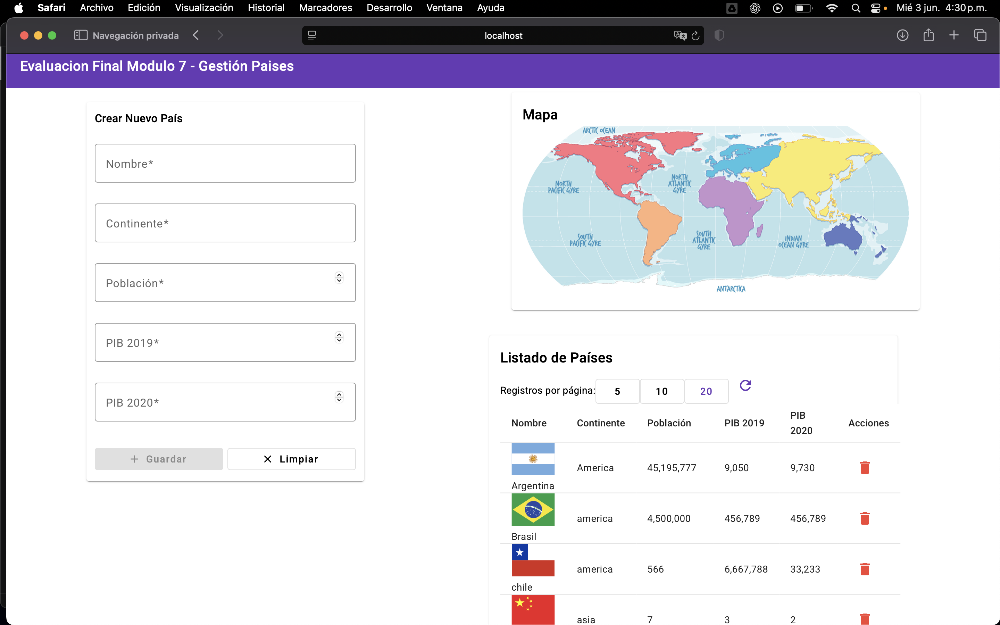
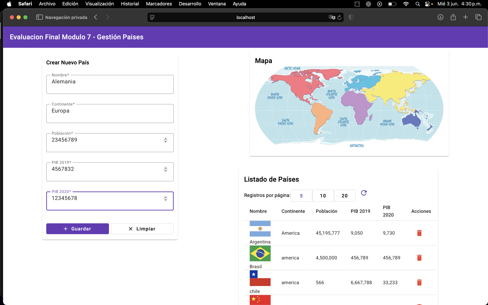
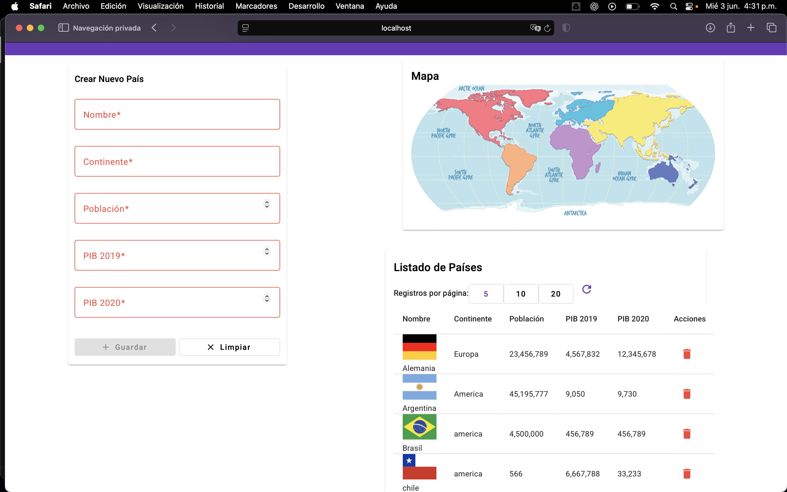

# 🌍 Gestión PIB Países | Full Stack Application

[](https://nodejs.org/)
[](https://angular.dev/)
[](https://www.postgresql.org/)
[](https://www.typescriptlang.org/)
[](https://expressjs.com/)
[]()

> **Sistema Full Stack con API REST versionada (V1/V2)** para gestión de datos geográficos y económicos de países con transacciones ACID y auditoría integrada

---

## 📋 Índice

- [Descripción](#-descripción)
- [Stack Tecnológico](#️-stack-tecnológico)
- [Highlights Técnicos](#-highlights-técnicos)
- [Arquitectura](#-arquitectura-del-sistema)
- [Características](#-características)
- [Demo](#-demo-del-sistema)
- [Habilidades Demostradas](#-habilidades-demostradas)
- [Quick Start](#-quick-start)
- [API Versioning](#-sistema-de-versionamiento)
- [Configuración](#-configuración)
- [Troubleshooting](#-solución-de-problemas)
- [Autor](#-autor)

---

## 🎯 Descripción

Sistema completo para administrar información geográfica, demográfica y económica de países con un enfoque especial en datos de PIB comparativos entre 2019 y 2020. Implementa **API REST versionada** siguiendo patrones profesionales de diseño con compatibilidad hacia atrás.

### Funcionalidades Principales

- **🌍 Gestión Integral**: CRUD completo de países con validaciones
- **📊 Datos Económicos**: PIB 2019 vs PIB 2020 con comparativas
- **🔄 API Versionada**: Sistema V1/V2 con evolución controlada
- **🔒 ACID Transactions**: Integridad de datos garantizada
- **📝 Auditoría**: Registro automático de todas las operaciones
- **🔍 Búsqueda Avanzada**: Filtrado por continente (V2)
- **📖 Paginación**: Navegación eficiente con metadata completa
- **🎨 UI Moderna**: Angular Material con diseño responsivo

---

## 🛠️ Stack Tecnológico

### Backend

| Tecnología | Versión | Propósito |
|------------|---------|-----------|
|  | 18+ | Runtime environment |
|  | 5.2 | Framework web |
|  | 12+ | Base de datos relacional |
|  | - | Sistema de módulos |
|  | Latest | Variables de entorno |
|  | - | Cross-origin requests |

### Frontend

| Tecnología | Versión | Propósito |
|------------|---------|-----------|
|  | 19.2 | Framework web |
|  | 5.7 | Tipado estático |
|  | 19.2 | Componentes UI |
|  | 7.8 | Programación reactiva |
|  | - | Nueva arquitectura |

---

## ⭐ Highlights Técnicos

### 🚀 API Versionada Profesional

- **Versionamiento V1/V2**: URLs diferenciadas con `/api/v1/` y `/api/v2/`
- **Compatibilidad hacia atrás**: Ambas versiones operativas simultáneamente
- **Respuestas diferenciadas**: Formatos optimizados por versión
- **Metadata en V2**: Paginación, timestamp y version info

```javascript
// V1 Response
{ "ok": true, "data": [...] }

// V2 Response
{
  "success": true,
  "result": {
    "countries": [...],
    "pagination": { "total": 5, "limit": 10, "offset": 0, "hasMore": false },
    "timestamp": "2025-01-15T10:30:00.000Z",
    "version": "2.0"
  }
}
```

### 🔒 Transacciones ACID

- **BEGIN/COMMIT/ROLLBACK**: Manejo completo de transacciones
- **Sistema de auditoría**: Tabla `paises_data_web` registra operaciones
- **Integridad referencial**: Foreign keys y restricciones
- **ON CONFLICT**: Upserts para mantener historial

### 🎨 Angular Moderno (v19)

- **Standalone Components**: Nueva arquitectura sin NgModules
- **RxJS Reactive Streams**: Programación reactiva pura
- **Angular Material**: Componentes UI enterprise-grade
- **TypeScript E2E**: Tipado completo frontend y backend

### 📊 Características Avanzadas

- **Paginación eficiente**: LIMIT/OFFSET con COUNT(*) para total
- **Búsqueda por continente**: Endpoint exclusivo V2
- **Mapeo de banderas**: Sistema inteligente con normalización NFD
- **Persistencia de versión**: localStorage para selección V1/V2

---

## 🏗️ Arquitectura del Sistema

```
┌─────────────────────────────────────────────────────────────┐
│                     FRONTEND (Angular 19)                    │
│                                                              │
│  ┌──────────────┐  ┌──────────────┐  ┌──────────────┐      │
│  │   Listado    │  │   Creación   │  │   Búsqueda   │      │
│  │   Países     │  │   Países     │  │  Continente  │      │
│  └──────────────┘  └──────────────┘  └──────────────┘      │
│         │                   │                   │            │
│         └───────────────────┴───────────────────┘            │
│                             │                                │
│                    ┌────────▼────────┐                       │
│                    │ Service (V1/V2)  │                       │
│                    │  + RxJS Streams  │                       │
│                    └────────┬────────┘                       │
└────────────────────────────┼─────────────────────────────────┘
                             │ HTTP/REST
                    ┌────────▼────────┐
                    │   API GATEWAY   │
                    │   Express.js    │
                    │  V1 │ V2 Routes │
                    └────────┬────────┘
                             │
┌────────────────────────────┼─────────────────────────────────┐
│                    ┌────────▼────────┐                        │
│                    │  CONTROLLERS    │                        │
│                    │  paises.controller.js │                 │
│                    │  paises.v2.controller.js               │
│                    └────────┬────────┘                        │
│                             │                                  │
│                    ┌────────▼────────┐                        │
│                    │  PostgreSQL     │                        │
│                    │  • paises       │                        │
│                    │  • paises_data  │                        │
│                    │  • auditoría    │                        │
│                    │  (ACID Tx)      │                        │
│                    └─────────────────┘                        │
│                                                             │
│              BACKEND (Node.js + PostgreSQL)                 │
└─────────────────────────────────────────────────────────────┘
```

### Flujo de Datos

1. **Frontend**: Componente → Service (V1/V2 selector) → HTTP Client
2. **API Gateway**: Express routes → Controller específico por versión
3. **Controller**: Transacción → Queries PostgreSQL → Response formateada
4. **Auditoría**: Cada operación se registra en `paises_data_web`

---

## ✨ Características

### Backend (eva7/)

| Característica | Descripción |
|----------------|-------------|
| ✅ API Versionada | Sistema V1/V2 con URLs diferenciadas |
| ✅ REST Completo | Operaciones CRUD en ambas versiones |
| ✅ PostgreSQL | Base de datos relacional con transacciones |
| ✅ ACID | BEGIN/COMMIT/ROLLBACK para integridad |
| ✅ Paginación | LIMIT/OFFSET con metadata de total |
| ✅ Auditoría | Registro automático de operaciones |
| ✅ CORS | Configuración para cross-origin |
| ✅ Variables de Entorno | Archivo .env para configuración |

### Frontend (eva7front/)

| Característica | Descripción |
|----------------|-------------|
| ✅ Selector de Versión | Cambio dinámico V1/V2 en UI |
| ✅ Angular 19 | Última versión con standalone components |
| ✅ Angular Material | Componentes UI profesionales |
| ✅ TypeScript | Tipado estático completo |
| ✅ RxJS | Programación reactiva |
| ✅ Búsqueda Continente | Funcionalidad exclusiva V2 |
| ✅ Formularios Reactivos | Validación y gestión eficiente |
| ✅ Banderas Nacionales | Identificación visual |

---

## 🎬 Demo del Sistema

### Selector de Versión API


*Cambio dinámico entre V1 (azul) y V2 (naranja) con selector visual*

### Gestión de Países



*Listado con paginación y banderas nacionales*

### Creación de País



*Formulario de creación con validaciones*

### Sistema de Auditoría



*Confirmación de operación con detalle de datos*

---

## 💡 Habilidades Demostradas

| Categoría | Tecnologías y Conceptos |
|-----------|-------------------------|
| **Backend** | Node.js, Express.js, PostgreSQL, REST API, ES Modules |
| **Frontend** | Angular 19, TypeScript 5.7, RxJS, Angular Material, Reactive Forms |
| **Database** | SQL, Transacciones ACID, Diseño relacional, Normalización |
| **Arquitectura** | API versionada, MVC, Separation of concerns, Clean code |
| **Patrones** | Versionamiento semántico, Repository, Service layer, Observer |
| **DevOps** | Variables de entorno, CORS, Configuración multi-ambiente |
| **Testing** | Scripting de pruebas automatizadas |
| **Soft Skills** | Documentación técnica, Organización de código, Git workflow |

---

## 🚀 Quick Start

```bash
# Clonar repositorio
git clone https://github.com/JamNow7/gestion-pib-paises.git
cd gestion-pib-paises

# Backend (Terminal 1)
cd eva7
npm install
cp .env.example .env           # Configurar credenciales PostgreSQL
createdb eva7                   # Crear base de datos
npm run dev                    # → http://localhost:4000

# Frontend (Terminal 2)
cd eva7front
npm install
ng serve                       # → http://localhost:4200
```

### Verificación

```bash
# Probar Backend V1
curl "http://localhost:4000/api/v1/paises?limit=2"

# Probar Backend V2
curl "http://localhost:4000/api/v2/paises?limit=2"

# Probar búsqueda V2
curl "http://localhost:4000/api/v2/paises/continente/America"
```

---

## 🔄 Sistema de Versionamiento

### Versiones Disponibles

#### **V1 (Estable)** - Formato Simple

```bash
GET    /api/v1/paises              # Listado
POST   /api/v1/paises              # Crear
DELETE /api/v1/paises/:nombre      # Eliminar
```

#### **V2 (Mejorada)** - Formato Optimizado

```bash
GET    /api/v2/paises                        # Listado con metadata
POST   /api/v2/paises                        # Crear con respuesta detallada
DELETE /api/v2/paises/:nombre                # Eliminar con confirmación
GET    /api/v2/paises/continente/:continente # Búsqueda por continente
```

### Características del Versionamiento

| Feature | V1 | V2 |
|---------|----|----|
| CRUD básico | ✅ | ✅ |
| Paginación | ✅ | ✅ |
| Búsqueda por continente | ❌ | ✅ |
| Metadata en respuesta | ❌ | ✅ |
| Timestamp | ❌ | ✅ |
| Compatibilidad hacia atrás | - | ✅ |

### Uso del Frontend

El frontend incluye un **selector de versión** que permite:
- Cambiar entre V1 y V2 con un clic
- Ver diferencias en tiempo real
- Acceder a funcionalidades exclusivas de V2
- Persistencia de la versión seleccionada (localStorage)

---

## 📁 Estructura del Proyecto

```
gestion-pib-paises/
│
├── eva7/                              # Backend Node.js + Express + PostgreSQL
│   ├── src/
│   │   ├── index.js                   # Punto de entrada con versionamiento
│   │   ├── config.js                  # Configuración general
│   │   ├── db.js                      # Pool de conexiones PostgreSQL
│   │   ├── controllers/
│   │   │   ├── paises.controller.js   # Controlador V1
│   │   │   └── paises.v2.controller.js # Controlador V2
│   │   └── routes/
│   │       ├── paises.routes.js       # Rutas V1
│   │       └── paises.v2.routes.js   # Rutas V2
│   ├── database/                      # Scripts de base de datos
│   ├── queries/                       # Consultas SQL
│   ├── test-versions.js              # Script de prueba de versiones
│   ├── VERSIONES.md                   # Documentación de versiones
│   └── readme.md                      # Documentación backend
│
├── eva7front/                         # Frontend Angular 19
│   ├── src/
│   │   ├── app/
│   │   │   ├── api-version-selector/  # Componente selector de versión
│   │   │   ├── buscar-pais-continente/# Búsqueda V2 por continente
│   │   │   ├── crear-pais/            # Formulario de creación
│   │   │   ├── paises/                # Listado principal
│   │   │   └── services/
│   │   │       └── countries.services.ts # Servicio multi-versión
│   │   └── environments/
│   │       ├── environment.ts         # Configuración desarrollo
│   │       └── environment.prod.ts    # Configuración producción
│   └── README.md                      # Documentación frontend
│
└── docs/                              # Documentación y capturas
    ├── api-version-2.png              # Sistema de versionamiento
    ├── listado-paises.png
    ├── creacion-pais.png
    ├── pais-agregado.png
    └── eliminacion-pais.png
```

---

## ⚙️ Configuración

### Backend (.env)

```env
DB_USER=postgres
DB_PASSWORD=tu_contraseña_aqui
DB_HOST=localhost
DB_PORT=5432
DB_DATABASE=eva7
PORT=4000
```

### Frontend (environment.ts)

```typescript
export const environment = {
  production: false,
  apiUrl: 'http://localhost:4000',
  apiEndpoint: '/api/v1/paises',
  fullApiUrl: 'http://localhost:4000/api/v1/paises',
  apiVersion: 'v1',
  availableVersions: ['v1', 'v2']
};
```

---

## 🔧 Solución de Problemas

### El backend no inicia

1. Verificar que PostgreSQL esté ejecutándose
   ```bash
   pg_isready
   ```

2. Crear base de datos si no existe
   ```bash
   createdb eva7
   ```

3. Verificar credenciales en `.env`

4. Confirmar puerto 4000 disponible

### El frontend no conecta

1. Confirmar backend ejecutándose en puerto 4000

2. Verificar configuración CORS en backend

3. Revisar URL en `environment.ts`

4. Abrir DevTools para ver errores de red

### Testing de Versiones

```bash
cd eva7
npm run test:versions    # Script comparativo V1 vs V2
```

---

## 📚 Documentación Adicional

- **Backend**: [`eva7/readme.md`](eva7/readme.md) - Configuración detallada backend
- **Frontend**: [`eva7front/README.md`](eva7front/README.md) - Configuración detallada frontend
- **Versiones**: [`eva7/VERSIONES.md`](eva7/VERSIONES.md) - Documentación completa del versionamiento

---

## 👤 Autor

**Claudio Cataldo**

- 🐙 GitHub: [JamNow7](https://github.com/JamNow7)

---

<div align="center">

**⭐ Si encuentras útil este proyecto, considera darle una estrella**

Desarrollado con ❤️ usando Node.js, Angular y PostgreSQL

</div>
